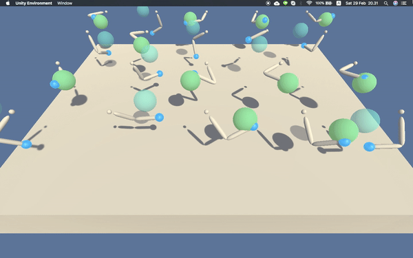

# Deep Reinforcement Learning : Continuous Control

This project repository is my work on 2nd Project: Continuous Control for Udacity's [Deep Reinforcement Learning Nanodegree](https://www.udacity.com/course/deep-reinforcement-learning-nanodegree--nd893).

## Project's Description

In this Continuous Control project, I have to train an agent to control a double-jointed arm move to target location. A reward of +0.1 is provided for each step that the agent's hand is in the goal location. Thus, the goal of your agent is to maintain its position at the target location for as many time steps as possible. The task is episodic, and in order to solve the environment, the agent must get an average score of +30 over 100 consecutive episodes.

## The Environment

The environment is provided by [Unity ML-agents](https://github.com/Unity-Technologies/ml-agents). For this project, you will work with the [Reacher](https://github.com/Unity-Technologies/ml-agents/blob/master/docs/Learning-Environment-Examples.md#reacher) environment on the Unity ML-agents Github page.

After checking how the environment provided by Unity behaves, here are the details about the rewards, state & action spaces:

#### Rewards

In this environment, a double-jointed arm can move to target locations. A reward of +0.1 is provided for each step that the agent's hand is in the goal location. Thus, the goal of your agent is to maintain its position at the target location for as many time steps as possible.

#### State Space

The observation space consists of 33 variables corresponding to position, rotation, velocity, and angular velocities of the arm. 

#### Action Space

Each action is a vector with four numbers, corresponding to torque applicable to two joints. Every entry in the action vector should be a number between -1 and 1.

## Project Installation

#### Step 1: Clone the DRLND Repository
1. Configure your Python environment by following instructions described in the [DRLND Github repository](https://github.com/udacity/deep-reinforcement-learning#dependencies). The instructions can be found in the [Readme.md](https://github.com/Unity-Technologies/ml-agents/blob/master/docs/Readme.md) file.
2. By following the instructions, then you will have your own PyTorch, the ML-agents toolkit, and all the Python packages required to complete the project.
3. (For Windows users) The ML-agents toolkit supports Windows 10.

#### Step 2: Download the Unity Environment
For running this project you need to install the Unity environment as completely described in the [Getting Started section](https://github.com/udacity/deep-reinforcement-learning/blob/master/p2_continuous-control/README.md).

#### Step 3: Explore the Environment
After you have followed two installment steps above, then you can explore the project environment by opening `Continuous_Control_DDPG.ipynb` located on the root repository. You can follow the instructions to learn how to use the Python API to control the agent.

## Train The Agent
You can try to train the agent yourself by executing the provided jupyter notebook within this project repository. By working in your local environment, the workspace will allow you to see the simulator of the environment and watch directly how our trained agent smartly behaves with the environment.

## Discussions
📨 if any discussion, please contact me anytime: muha.muttaqien@gmail.com
