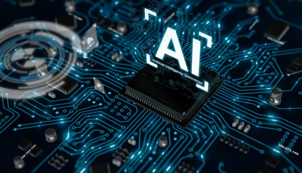

# AI-Lab 
📁 Generated by: Muhammad Angga Muttaqien, in Jan 7, 2018

🔬 Absolutely comfort lab for me to work around with my own AI pieces of stuff and see a lot of surprises, often times, indistinguishable from magic. The major exploration topics include:

1. Machine Learning
2. Deep Learning (e.g. vision, sequence and reinforcement learning)
3. Advanced Techniques (e.g. GAN, One-Shot Learning, Symbolic AI, Knowledge Graphs etc.)

`Now, I'm working on Reinforcement Learning`



The best way to get deeper into AI technology is to get hands-on with it. In 2019-2020, I have an enthusiastic plan to conduct experiments with numerous and diverse deep learning applications based on Computer Vision ([CV](https://en.wikipedia.org/wiki/Computer_vision)), Natural Language Processing ([NLP](https://en.wikipedia.org/wiki/Natural_language_processing)) and Reinforcement Learning ([RL](https://en.wikipedia.org/wiki/Reinforcement_learning)) technologies. Through learning-by-doing, below is the list I envision:

## CV Applications
```text
1. Object Classification
2. Object Detection
3. Real-time Object Detection
4. Semantic Segmentation
5. Instance Segmentation
6. Human Pose Detection
7. Visual Question Answering
```

## NLP Applications
```text
1. Machine Translation System
2. Sentiment Analysis
3. Text Summarization
4. Topic Modeling
5. Chatbot
6. Image Captioning
7. Speech Recognition
```

## RL Applications
```text
1. MDP Using Dynamic Programming Method
2. Monte Carlo Method
3. Temporal-Difference Method (Sarsa, Sarsamax, Expected Sarsa)
4. Value-Based Method (DQN, Double-DQN, Dueling-DQN, Prioritized Replay, Noisy DQN, CNN-DQN)
5. Policy-Based Method (TRPO, PPO)
6. Actor-Critic Method (A2C, DDPG)
7. Multi-Agent Method
```

## Dependencies

This lab requires **Python 3.7.3** and the following Python libraries installed:

* Basic Libraries: [NumPy](http://www.numpy.org/), [Matplotlib](http://matplotlib.org/)
* Domain-supporting Libraries: [OpenCV](https://opencv.org/), [NLTK](https://www.nltk.org/), [Gym](http://gym.openai.com/)
* Deep-learning Frameworks: [Keras](https://keras.io/), [PyTorch](https://pytorch.org/), [TensorFlow](https://www.tensorflow.org/), [ReNom](http://www.renom.jp/)

📨 if any discussion, please contact me anytime: muha.muttaqien@gmail.com
