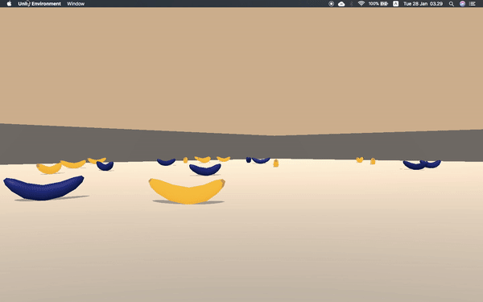

# Deep Reinforcement Learning : Navigation

This project repository is my work on 1st Project: Navigation for Udacity's [Deep Reinforcement Learning Nanodegree](https://www.udacity.com/course/deep-reinforcement-learning-nanodegree--nd893).

### Project's Description
In this navigation project, I have to train an agent to navigate on a large square world provided by [Unity Environment](https://github.com/Unity-Technologies/ml-agents) and collect yellow bananas. The goal is to collect as many yellow bananas as possible while at the same time avoiding blue bananas. The task is episodic, and in order to solve the environment, the agent must get an average score of at least +13 over 100 consecutive episodes.

After checking how the environment provided by Unity behaves, here is the details about the rewards, state & action spaces:

### Rewards

1. The agent is given a reward of +1 for successfully collecting a yellow banana]
2. Reward of -1 for collecting a blue banana

### State Space

The environment contains 37 dimensions and the agent's velocity, along with ray-based perception of objects around the agent's forward direction.

### State Space 

Has 37 dimensions and the contains the agents velocity, along with ray-based precpetion of objects around the agents foward direction.

### Action Space

There are four possible discreate actions that agent can perform including 0 for move forward, 1 for move backward, 2 for turn left and 3 for turn right.
